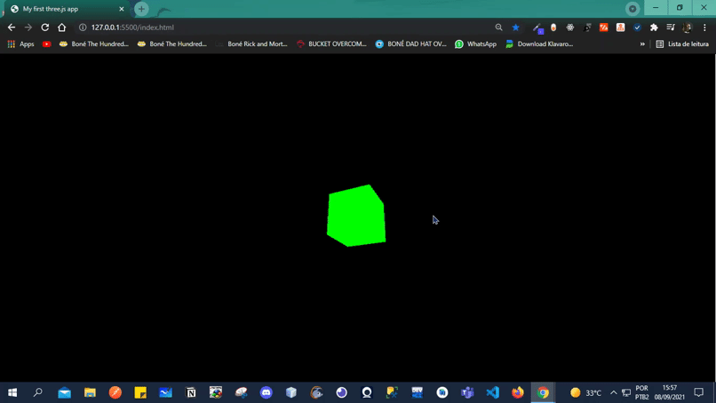

# my first three.js app ( Meu Primeiro app three.js )

Three.js é uma biblioteca JavaScript/API cross-browser usada para criar e mostrar gráficos 3D animados em um navegador web. Three.js usa WebGL. O código-fonte é hospedado em um repositório no GitHub.

## Linguagens usadas [ Languages used ]

JavaScript <!--💛--> ✔

  

       
